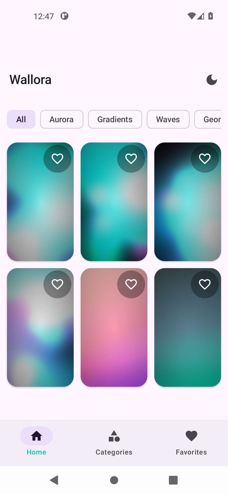
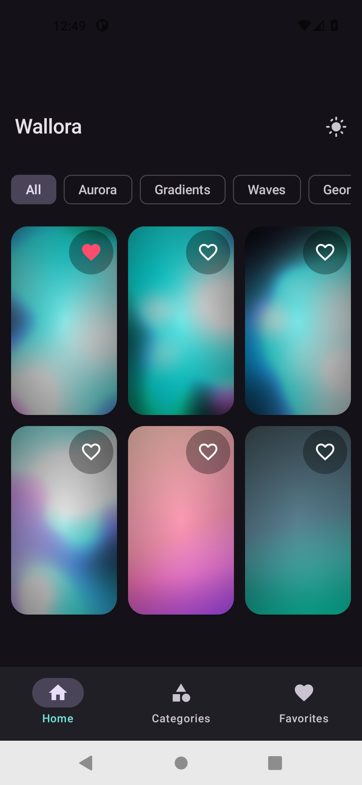
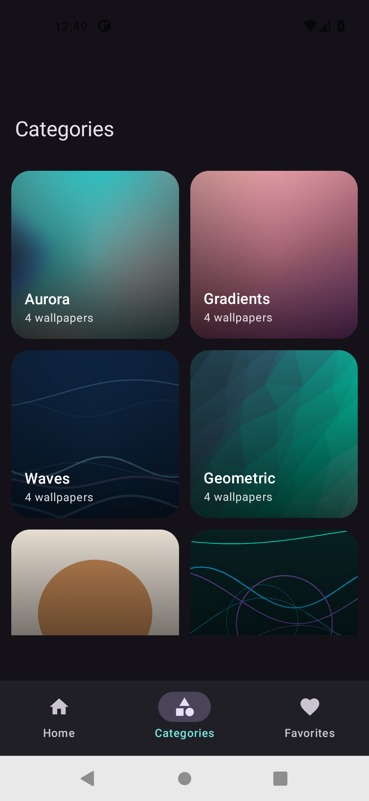
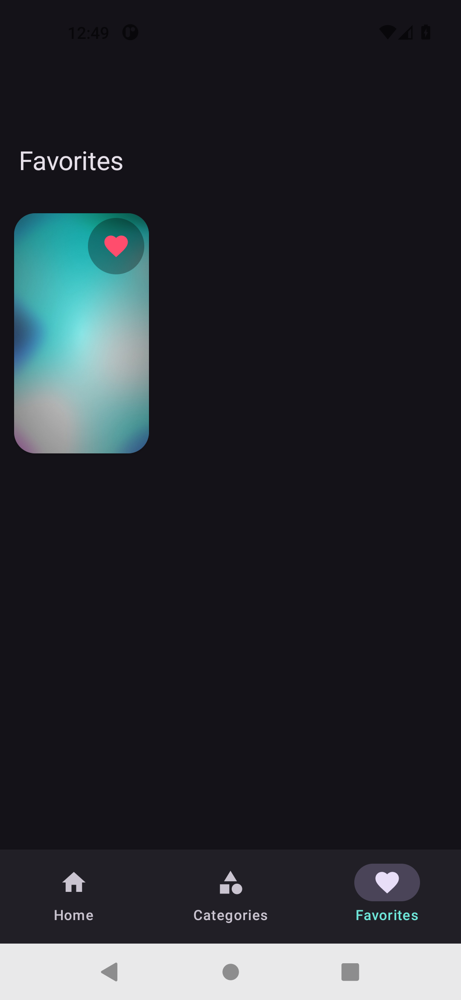
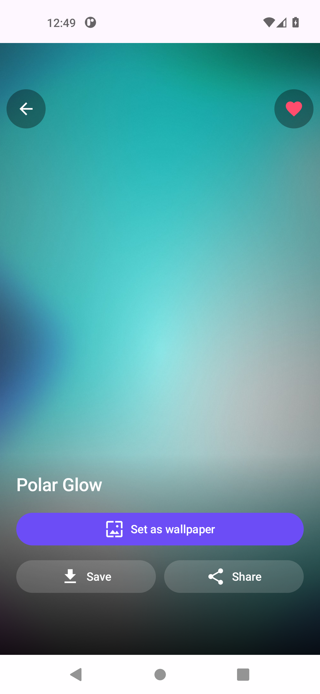
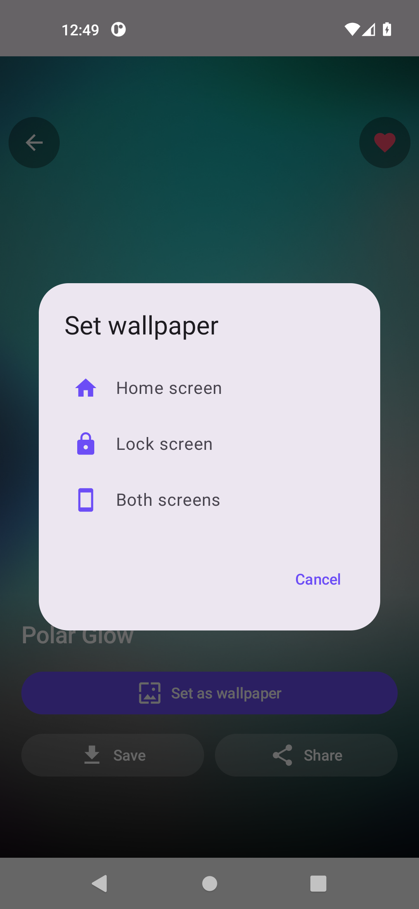
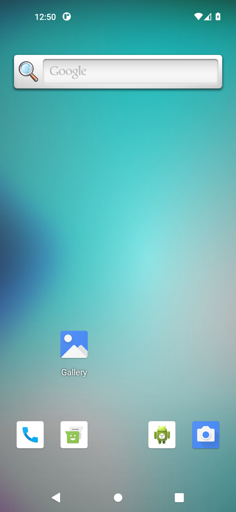

# Wallora — Phone Wallpaper App

A native Android wallpaper app built with **Kotlin + Jetpack Compose**. It ships with
**24 original, code-generated wallpapers** (no third-party images) and lets you browse,
favorite, preview, set, save and share them.

## Features

- **Grid gallery** — browse all wallpapers in an adaptive thumbnail grid.
- **Categories** — Aurora, Gradients, Waves, Geometric, Minimal, Neon.
- **Full-screen preview** — tap any wallpaper to open it edge-to-edge.
- **Set as wallpaper** — choose Home screen, Lock screen, or both.
- **Favorites** — heart any wallpaper; stored persistently with DataStore.
- **Save** — writes the image to `Pictures/Wallora` on the device.
- **Share** — sends the image to any app via the system share sheet.
- **Dark mode** — follows the system by default, with a one-tap override in the top bar.
- **Material You** — uses dynamic color on Android 12+.
- **Cloud wallpapers (optional)** — Firebase Firestore catalogue + Cloud Storage images, so you can publish wallpapers without shipping an app update. Falls back to the bundled set when offline.
- **Admin panel** — manage the catalogue from the app (shield icon → sign in) or from a browser dashboard.
- **Analytics & Crashlytics** — Firebase Analytics events (set / save / share / favourite) and crash reporting.

## Screenshots

Captured from the app running on an emulator (`screenshots/`):

| Home (light) | Home (dark) | Categories |
|---|---|---|
|  |  |  |

| Favorites | Detail | Set wallpaper |
|---|---|---|
|  |  |  |

Proof the wallpaper is applied to the device (launcher now shows the chosen wallpaper):



## Tech stack

| Piece | Version |
|---|---|
| Android Gradle Plugin | 9.4.1 (built-in Kotlin) |
| Gradle | 9.6.0 |
| Kotlin | 2.2.10 |
| Jetpack Compose | BOM 2026.09.00 (Material 3) |
| Navigation Compose | 2.10.2 |
| DataStore Preferences | 1.2.1 |
| Coil | 2.7.0 |
| Firebase | BOM 34.19.0 (Firestore, Storage, Auth, Analytics, Crashlytics) |
| compileSdk / targetSdk | 37 (Android 17) |
| minSdk | 29 (Android 10) |

## Firebase (cloud wallpapers + admin)

The app is **already wired for Firebase** and builds with a placeholder
`app/google-services.json`, so it runs out of the box on the 24 bundled wallpapers. To
enable cloud content and the admin panels, follow **[`firebase/SETUP.md`](firebase/SETUP.md)**
(about 10 minutes):

1. Create a Firebase project and register the Android app `com.wallora.app`
2. Drop the real `google-services.json` into `app/`
3. Enable **Email/Password** auth and create one admin user
4. Create **Firestore** + **Storage** and paste the rules from `firebase/`
5. Paste your web config into `firebase/webadmin/firebase-config.js`

| Piece | Where |
|---|---|
| Firestore rules | `firebase/firestore.rules` |
| Storage rules | `firebase/storage.rules` |
| Web admin dashboard | `firebase/webadmin/` |
| Full walkthrough | `firebase/SETUP.md` |

Data model:

| Path | Fields |
|---|---|
| `wallpapers/{id}` | `title`, `category`, `url`, `path`, `createdAt` |
| `categories/{id}` | `title` |
| Storage `wallpapers/{uuid}.jpg` | the image file |

In the app, tap the **shield icon** in the top bar to open the admin screen and sign in
with the account you created.

## Open it in Android Studio

1. Open Android Studio.
2. **File → Open…** and select this folder (`Wallora`).
3. Let Gradle sync, then press **Run ▶**.

## Build from the command line

Gradle needs a JDK 17+ (Android Studio bundles one). From this folder:

```bash
# Use Android Studio's bundled JDK (adjust the path if yours differs)
export JAVA_HOME="/home/ahmadq/Downloads/android-studio-quail4-patch1-linux/android-studio/jbr"

./gradlew :app:assembleDebug          # build APK
./gradlew :app:installDebug           # build + install on a connected device
```

The debug APK is written to:

```
app/build/outputs/apk/debug/app-debug.apk
```

## Project structure

```
app/src/main/
├─ java/com/wallora/app/
│  ├─ MainActivity.kt              # entry point, wires theme + ViewModel
│  ├─ data/
│  │  ├─ Wallpaper.kt              # model: Wallpaper (bundled or remote), Category
│  │  ├─ WallpaperCatalog.kt       # the bundled catalogue (edit here to add images)
│  │  ├─ RemoteWallpaperRepository.kt # live Firestore reads
│  │  ├─ AdminRepository.kt        # auth, upload, delete, categories
│  │  └─ PreferencesRepository.kt  # DataStore: favorites + dark mode
│  ├─ ui/
│  │  ├─ WalloraApp.kt             # Scaffold, bottom nav, NavHost
│  │  ├─ WallpaperViewModel.kt
│  │  ├─ components/               # WallpaperCard, WallpaperGrid, CategoryChips…
│  │  ├─ screens/                  # Home, Categories, Category, Favorites, Detail, Admin
│  │  └─ theme/                    # Color, Type, Theme
│  └─ util/
│     ├─ WallpaperSetter.kt        # WallpaperManager
│     ├─ WallpaperImages.kt        # load bitmap from resource (URL coming) or URL
│     ├─ ImageSaver.kt             # MediaStore (Pictures/Wallora)
│     ├─ ShareUtils.kt             # FileProvider + ACTION_SEND
│     └─ Analytics.kt              # Firebase Analytics + Crashlytics
└─ res/
   ├─ drawable-nodpi/wp_01..24.jpg # the 24 wallpapers (1080×1920)
   ├─ drawable/ic_*.xml            # app + UI icons (vector)
   └─ mipmap-anydpi-v26/           # adaptive launcher icon
```

## Adding your own wallpapers

1. Drop your images into `app/src/main/res/drawable-nodpi/` using lowercase names,
   e.g. `my_wall_01.jpg` (letters, digits, underscores only).
2. Add a line to `WallpaperCatalog.wallpapers`:

   ```kotlin
   Wallpaper("my_wall_01", "My Wallpaper", "gradient", R.drawable.my_wall_01),
   ```

3. If you want a new category, add a `Category("mycat", "My Category")` entry too.

Portrait images around **1080 × 1920** look best.

## Renaming the app

- Display name: `app/src/main/res/values/strings.xml` → `app_name`.
- Package / applicationId: change `namespace` and `applicationId` in
  `app/build.gradle.kts` (and the `package` lines in the Kotlin files).

## Notes

- **Verified** on Android emulators (x86_64): builds, installs, launches, and the
  gallery, categories, category filtering, favorites (persisted via DataStore),
  save-to-gallery, share sheet, dark-mode toggle, and **setting the wallpaper**
  (confirmed by the launcher background changing) all work. A saved image was verified
  as a valid 1080×1920 JPEG. The images in `screenshots/` come from the running app.
- **Wallpaper setting** uses `WallpaperManager`; lock-screen setting may be restricted
  by some device manufacturers.
- The **debug** APK is ~36 MB because it keeps debugging metadata and Compose tooling.
  Release builds with R8 will be much smaller.
- The bundled artwork is generated by a script (`gen_wallpapers.py` was used during
  development); it is original and free to use.
